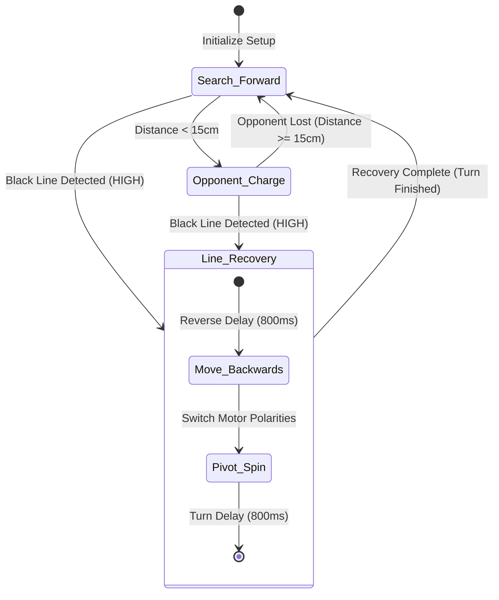

# 🤖 Autonomous Sumobot Control System

An advanced, production-grade control codebase for an autonomous Sumo Robot (Sumobot) designed to compete in Sumo Ring competitions. This project controls a robot with the primary goal of staying within the ring (using an IR line sensor) while detecting and pushing opponents out (using an Ultrasonic distance sensor).

The repository contains two operational modes tailored for different hardware setups:
1. **`Sumobot using IR sensor.ino`**: Standard version focusing strictly on border detection and border evasion (line-bound cruising).
2. **`Sumobot IR with Ultrasonic.ino`**: Advanced version integrating line safety with target acquisition and charge routines.

---

## 📋 Table of Contents
* [Key Features](#-key-features)
* [System Architecture](#-system-architecture)
* [Hardware Specifications & Schematic](#-hardware-specifications--schematic)
* [Wiring Guide](#-wiring-guide)
* [Operational Logic & State Flow](#-operational-logic--state-flow)
* [Pseudocode](#-pseudocode)
* [Calibration & Troubleshooting](#-calibration--troubleshooting)
* [License](#-license)

---

## ⚡ Key Features

* **Safety-First Priority Queuing**: Boundary detection immediately interrupts search/attack sweeps, preventing the robot from driving itself out.
* **Intelligent Evacuation Direction**: Alternating evacuation directions (turning Left for lines 1–3, Right for lines 4–6) prevent the robot from getting trapped in loops or predictable patterns.
* **Ultrasonic Pulse Filtering**: Fixed standard Arduino timeout bug where a sensor timeout (`0` pulse duration) is incorrectly evaluated as an opponent directly in front.
* **Configurable Tactile Strategy**: Allows optional pre-charge backing maneuvers (wind-up phase) to optimize kinetic energy transfer.
* **RAM-Optimized Debug Logging**: Utilizes the Arduino `F()` macro to preserve precious SRAM on microcontrollers like the Arduino Nano.

---

## 📐 System Architecture

The robot works as a finite state machine prioritizing survivability over offense:



---

## 🔧 Hardware Specifications & Schematic

The robot conforms to standard mini-sumo dimensions and constraints:
* **Dimensions**: Max 200mm × 200mm
* **Weight**: Max 500 grams
* **Processor**: Arduino Nano (ATmega328P)
* **Motor Driver**: L298N Dual H-Bridge Driver
* **Actuators**: Dual DC Geared Motors (1:48 or 1:120 ratio)
* **Power Source**: 2 × 18650 Li-ion batteries (7.4V series configuration)
* **Line Sensor**: TCRT5000 IR Reflective Sensor (Active-High for dark surface)
* **Object Sensor**: HC-SR04 Ultrasonic Ranging Sensor

Refer to the included [Sumobot_bb.pdf](file:///c:/Users/kodic/Downloads/Sumobot/Sumobot_bb.pdf) file in the workspace directory for the detailed breadboard wiring diagram.

---

## 🔌 Wiring Guide

### 1. Advanced Configuration: IR + Ultrasonic
| Component | Arduino Pin | Pin Function / Direction | L298N Driver Connection |
| :--- | :--- | :--- | :--- |
| **IR Sensor** | `A0` | Input (Digital Read) | — |
| **HC-SR04 Trig** | `D5` | Output (Trigger Pulse) | — |
| **HC-SR04 Echo** | `D6` | Input (Echo Pulse Duration) | — |
| **L298N ENA** | `D2` | Output (PWM Left Speed Enable) | `ENA` |
| **L298N ENB** | `D3` | Output (PWM Right Speed Enable) | `ENB` |
| **L298N IN1** | `D7` | Output (Left Motor Direction A) | `IN1` |
| **L298N IN2** | `D8` | Output (Left Motor Direction B) | `IN2` |
| **L298N IN3** | `D9` | Output (Right Motor Direction A)| `IN3` |
| **L298N IN4** | `D10`| Output (Right Motor Direction B)| `IN4` |

### 2. Standard Configuration: IR Only
| Component | Arduino Pin | Pin Function / Direction | L298N Driver Connection |
| :--- | :--- | :--- | :--- |
| **IR Sensor** | `A0` | Input (Digital Read) | — |
| **L298N IN1** | `D5` | Output (Left Motor Direction A) | `IN1` |
| **L298N IN2** | `D6` | Output (Left Motor Direction B) | `IN2` |
| **L298N IN3** | `D7` | Output (Right Motor Direction A)| `IN3` |
| **L298N IN4** | `D8` | Output (Right Motor Direction B)| `IN4` |
| **L298N ENA/ENB**| — | Connected to Onboard 5V Jumpers | — |

---

## 🧠 Operational Logic & State Flow

### Boundary Avoidance (Highest Priority)
1. **Edge Transition**: The robot constantly reads the IR sensor connected to `A0`. In typical sumo rings (black surface with a white border, or vice-versa), transitioning onto the border switches the sensor reading to `LINE_DETECTED` (HIGH).
2. **Direction Alternation**: To avoid spinning in circles or getting stuck, the robot monitors `darklineCount`.
   * **Line Detections 1–3**: Reverse, then spin **Left** (counter-clockwise).
   * **Line Detections 4–6**: Reverse, then spin **Right** (clockwise).
   * **At 6 Detections**: The count resets to `0` to keep patterns diverse.
3. **Early Exit**: During a boundary detection, target scan routines are skipped to avoid tracking targets outside the ring boundaries.

### Target Scan & Engagement (Active in Safe Zone)
1. **Ranging**: The HC-SR04 ultrasonic sensor fires a sound pulse. If the reflected sound wave returns under `15cm` (configurable via `OPPONENT_THRESHOLD_CM`), it registers an opponent.
2. **Bug Prevention**: Standard implementations of `pulseIn` return `0` if an echo doesn't return (nothing is in range). If unchecked, `0 < 15` evaluates as true, causing the robot to charge empty space. The refactored code intercepts `0` and returns `999cm` (out-of-range), preventing false attacks.
3. **Engage**: Upon verification, the motor controller ramps up to `SPEED_ATTACK` (100% duty cycle) and charges.

---

## 📝 Pseudocode

### 💡 Advanced Mode: IR + Ultrasonic
```text
INITIALIZE Motor Control Pins (IN1, IN2, IN3, IN4, ENA, ENB) as OUTPUT
INITIALIZE Ultrasonic Pins (TRIG as OUTPUT, ECHO as INPUT)
INITIALIZE IR Sensor Pin (A0) as INPUT
INITIALIZE Serial at 9600 bps

LOOP:
    lineState = DIGITAL_READ(A0)
    distance = READ_ULTRASONIC_DISTANCE_CM()

    // 1. Edge/Border Avoidance Routine
    IF lineState == LINE_DETECTED AND previousValue == SURFACE_WHITE:
        darklineCount = darklineCount + 1
        
        // Execute recovery actions
        IF darklineCount >= 1 AND darklineCount <= 3:
            EXECUTE turnLeft()   // Reverse 800ms, Pivot Left 800ms
        ELSE IF darklineCount >= 4 AND darklineCount <= 6:
            EXECUTE turnRight()  // Reverse 800ms, Pivot Right 800ms
        ENDIF

        IF darklineCount >= 6:
            darklineCount = 0
        
        previousValue = LINE_DETECTED
        CONTINUE // Skip current cycle to avoid using old distance calculations
    ENDIF

    previousValue = lineState

    // 2. Safe Surface Maneuvers
    IF lineState == SURFACE_WHITE:
        IF distance > 0 AND distance < OPPONENT_THRESHOLD_CM:
            EXECUTE pushOpponent(SPEED_ATTACK) // Full speed forward charge
        ELSE:
            EXECUTE moveForward(SPEED_CRUISE)  // Lower speed searching forward
        ENDIF
    ELSE:
        // Safety Fallback (Still sitting on the black border)
        EXECUTE stopMotors()
    ENDIF
```

---

## ⚙️ Calibration & Troubleshooting

### 🔍 Calibrating the IR Line Sensor
1. Place the Sumobot inside the sumo ring (on the main surface). Note the value printed to the Serial Monitor.
2. Place the Sumobot's front nose directly over the border line. Note the value printed to the Serial Monitor.
3. Adjust the built-in potentiometer on the TCRT5000 sensor board using a small screwdriver until the onboard indicator LED turns ON only when crossing the border line.
4. If your sensor reads `LOW` on the line and `HIGH` on the surface, invert the logic in the code:
   ```cpp
   const int LINE_DETECTED = LOW;
   const int SURFACE_WHITE = HIGH;
   ```

### 🏎️ Troubleshooting Motor Directions
If the robot spins in place or moves backwards when it should move forward:
* **Hardware Solution**: Swap the positive and negative wire leads of the affected motor at the L298N terminal blocks.
* **Software Solution**: Adjust the logic levels in `moveForward()` and `moveBackwards()`. For example, if the left motor spins backwards during forward movements, change:
  ```cpp
  digitalWrite(PIN_MOTOR_IN1, HIGH); // Swap IN1 and IN2 states
  digitalWrite(PIN_MOTOR_IN2, LOW);
  ```

### 📡 Testing the Ultrasonic Sensor
1. Open the Serial Monitor at `9600` baud.
2. Put an obstacle (like your hand or a box) in front of the robot.
3. Ensure the serial print outputs "Opponent detected at X cm! Charging!" only when the obstacle is within 15 cm.
4. If the distance readings are constantly `999` or fluctuating wildly, verify that your Echo and Trigger pins are not swapped on the Arduino Nano.

